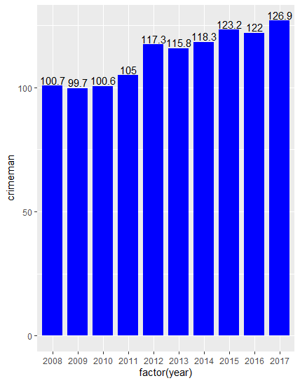

# 第五次作业

  本次作业选择的两张图表一张是条形图，一张是既有条形图也有折线图的。如下二图：
  
  
  
为了在R Studio里实现第一张图，使用了如下代码：

>crimeman1 <- read_excel("crimeman.xlsx")  #首先读取和存储数据    
>ggplot(crimeman1,aes(x=factor(year),y=crimeman)) +  #然后照葫芦画瓢使用ggplot这个包    
>+geom_col(fill ="blue",width =0.8,position=position_dodge(1.5)) +  #下面照着书籍了调整了一些参数    
>+geom_text(aes(label=crimeman),vjust = -0.2,colour = "black")

得到了下面这个图：

  
  
 
   但是在第二个图的复刻中遇到了很大困难，查了一些资料没法解决如何在一个图中同时画出数据不同的条形图和折线图，然后一下午过去了，感觉眼睛不太舒服，有要近视的感觉，所以不再尝试了，请老师见谅。下面是尝试过的一些失败代码（这个您应该不必看.....）：
   
 >rate <- read_excel("rate.xlsx")    
 >ggplot(rate) +    
>+geom_col(aes(x=factor(year),y=crimeman_under18)) +    
>+geom_line(aes(x=factor(year),y=rate_crimeman_under18))

 >rate <- read_excel("rate.xlsx")
 >ggpolt(rate,aes(x = factor(year),y=crimeman_under18,z=rate_crimeman_under18)) +
 >+geom_col(fill ="blue",aes(x = factor(year),y=crimeman_under18) +
 >+geom_line(aes(x=factor(year),y=rate_crimeman_under18))
 
 
   

[之前的作业](https://github.com/cheerupyxolive/keshihuazuoye/blob/master/previoushw.md)

