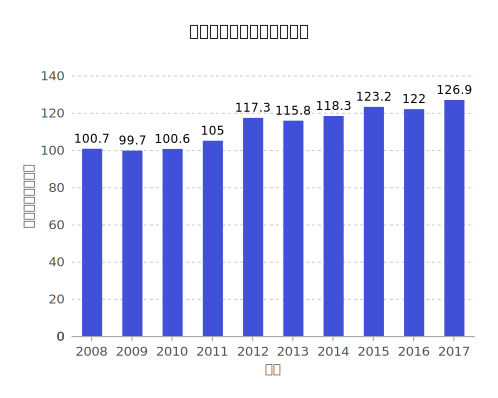
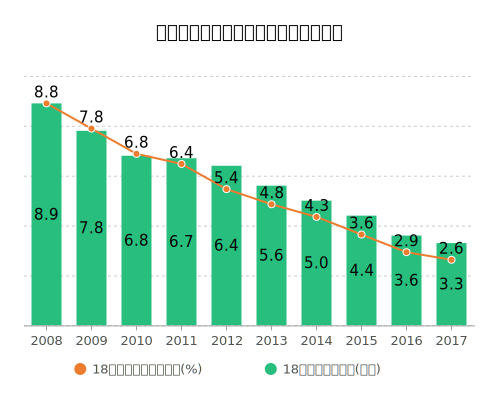

# 第五次作业

### 1.图文呈现       
　　**从“蓝极速案”到“大连女孩被害案”，公众的不满在哪里**    
　　近期倍受关注的大连女孩被害案件，以不满14岁的凶手被收容教养3年而告终。    
　　作案前的不良行径，凶狠的作案手法，作案后的恶劣态度，虽然蔡某某还有2个月才到达刑法中的刑事责任年龄，但这样的判决依旧是难以令公众满意的。类似的案件在2002年就有过：当时三名纵火者（1名13岁，2名14岁）在凌晨纵火烧掉了蓝极速网吧，造成了25人死亡，12人受伤，这是当时自建国以来北京发生的最严重的的火灾案件。最终一名未满14周岁的作案者同样免于刑事责任，两人被判处无期徒刑，其中1名作案者甚至拒绝道歉，态度恶劣。    
　　这些案件中对作案者的判决，难免会引起公众的失望和不满情绪，引发对我国未成年人刑罚的讨论甚至上升到学校、家庭教育、各类制度等方面。但总体上看，在近年来总罪犯人数未见减少的情况下，客观来说我国在减少未成年人犯罪方面是在进步的，甚至做得不错：
  
  
  
  
  
　　[“且根据《中国法律年鉴》的统计数据来看，近年我国未成年人犯罪率是也是在下降的，我国未成年人犯罪率是在下降的，且较低年龄的犯罪人只占极少比例。”](http://news.jstv.com/a/20191030/1572403162687.shtml?jsbcApp=1)    
　　可以做这样一个比喻，在我国，14岁至16周岁犯罪受到刑法的惩罚是60,16-18岁是80，18岁以上是100，那么14岁以下就是0，可以说完全免除了刑事责任，像“收容教养”这样的制度未免过于“温和”。所以，从未成年人犯罪的角度来说，公众的不满和失望来自这些作案性质恶劣且低于刑责年龄的人未能够受到相对公正的惩罚，而讨论和诉求也多在此，上升到更高层面的讨论对眼前现实问题的解决或许作用不太大。故当前的紧迫性在于把在刑责年龄以下的刑罚从“0”变成有，建立健全分级制度，才能让类似的看起来没有起到惩罚和警示作用的判决案例变少，这是解决问题的务实方法。
  
### 2.过程步骤及数据来源          
- 本次作业的过程大概是这样的：在网上搜索查看相关的新闻报道（之前我对此事并不了解），看见评论中的一部分声音还是相当失望和激愤（这还不排除一些质疑的声音未被呈现的因素）。我的想法是，难道我国在青少年犯罪上就有如此不堪？通过[国家统计局搜索到的相关数据](http://data.stats.gov.cn/easyquery.htm?cn=C01&zb=A0S0P&sj=2018)及如[相关新闻里呈现的一些数据](http://news.jstv.com/a/20191030/1572403162687.shtml?jsbcApp=1)，我想问题确实不小，但并没有那么糟糕。
- 现在似乎但凡有些看上去很“正确”的观点出现，相当多的人就不屑一顾，就要去质疑、批判一下，发挥一下所谓的"critical thinking"，我想这也是不太好的。我不知道老师会不会质疑我从官方渠道找来的数据的可信度，但我依然愿意这样去做。您说得对，别太懒太天真，到了这个阶段我们当然都知道从多渠道多角度地去想事情，但我想为什么我们对有的渠道和观点好像十分相信，对有的下意识地质疑，这似乎也像是个“陷阱”。我也愿意相信，有的事情并没有那么复杂，或许就是可以简单。
- 由于有一些类似“反批判”的思想，有不少主观的东西，使得这太像是[新闻]，请老师见谅。（不过也没要求一定是新闻吧..）

[之前的作业](https://github.com/cheerupyxolive/keshihuazuoye/blob/master/previoushw.md)
